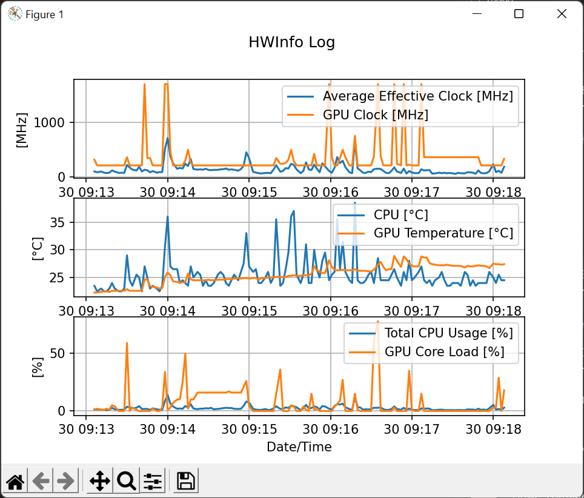

# HWInfo Grapher

This is a small project that generates a graph from CSV files produced by [HWInfo](https://www.hwinfo.com/) logging.

Usage:
```
# list the available keys in the CSV file
$ python -m hwinfo_grapher /path/to/log.csv --list-keys

# generate a graph from the provided keys
$ python -m hwinfo_grapher /path/to/log.csv "key1" "key2" ...
```


